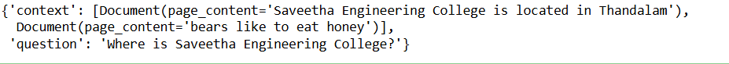

## Design and Implementation of LangChain Expression Language (LCEL) Expressions

### AIM:
To design and implement a LangChain Expression Language (LCEL) expression that utilizes at least two prompt parameters and three key components (prompt, model, and output parser), and to evaluate its functionality by analyzing relevant examples of its application in real-world scenarios.

### PROBLEM STATEMENT:
To design and implement LangChain Expression Language (LCEL) expressions that can answer personalized queries using prompt variables (Simple Chain) retrieve contextually relevant information from a vector store and generate responses (Complex Chain).

### DESIGN STEPS:

#### STEP 1: 
Create a prompt template with placeholders for at least two parameters.

#### STEP 2:
Use LangChain's language model to process the prompt and generate a response.

#### STEP 3:
Implement an output parser to extract structured results from the model's response.
## PROGRAM:
### Simple Chain:
```py
import os
import openai

from dotenv import load_dotenv, find_dotenv
_ = load_dotenv(find_dotenv()) # read local .env file
openai.api_key = os.environ['OPENAI_API_KEY']

from langchain.prompts import ChatPromptTemplate
from langchain.chat_models import ChatOpenAI
from langchain.schema.output_parser import StrOutputParser

prompt = ChatPromptTemplate.from_template(
    "Tell me about this cricketer {Name}"
)
model = ChatOpenAI()
output_parser = StrOutputParser()

chain = prompt | model | output_parser

chain.invoke({"Name": "Virat Kohli"})

```

### Complex Chain:
```py
from langchain.embeddings import OpenAIEmbeddings
from langchain.vectorstores import DocArrayInMemorySearch

vectorstore = DocArrayInMemorySearch.from_texts(
    ["Saveetha Engineering College is located in Thandalam", "bears like to eat honey"],
    embedding=OpenAIEmbeddings()
)
retriever = vectorstore.as_retriever()

retriever.get_relevant_documents("where is Saveetha Enginnering College?")

retriever.get_relevant_documents("what do bears like to eat")

template = """Answer the question based only on the following context:
{context}

Question: {question}
"""
prompt = ChatPromptTemplate.from_template(template)

from langchain.schema.runnable import RunnableMap

chain = RunnableMap({
    "context": lambda x: retriever.get_relevant_documents(x["question"]),
    "question": lambda x: x["question"]
}) | prompt | model | output_parser

chain.invoke({"question": "Where is Saveetha Engineering College?"})

inputs = RunnableMap({
    "context": lambda x: retriever.get_relevant_documents(x["question"]),
    "question": lambda x: x["question"]
})

inputs.invoke({"question": "Where is Saveetha Engineering College?"})

```


### OUTPUT:

### Simple Chain:


### Complex Chain:


### RESULT:
Hence,the program to design and implement a LangChain Expression Language (LCEL) expression that utilizes at least two prompt parameters and three key components (prompt, model, and output parser), and to evaluate its functionality by analyzing relevant examples of its application in real-world scenarios is written and successfully executed.
